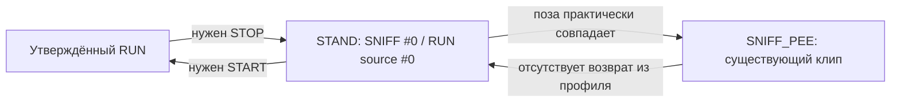

# Bulldog №4 — исследование общей позы STAND

**Вывод:** у RUN и начала SNIFF_PEE есть почти одинаковая устойчивая стойка. Однако SNIFF_PEE заканчивается в другом ракурсе и иной позе. Один неподвижный STAND не соединит текущий SNIFF_PEE с RUN: скачок переместится на границу `SNIFF_PEE → STAND`. Никакой новый переход или исходное видео в этом исследовании не создано. Кадры ниже — производные PNG для оценки и возможной работы в Kling, не утверждённые анимационные assets.

## Материалы и границы исследования

- Исходный RUN MP4: 121 кадр, 1276×720, 24 FPS. Кадры #0–20 содержат устойчивую стойку; затем собака начинает движение. Утверждённый прозрачный RUN использует исходные кадры #40–120 и содержит 81 кадр. Никакого стоячего кадра в утверждённом RUN WebM нет.
- Исходный SNIFF_PEE MP4 и прозрачный v2: 241 кадр, 1276×720, 24 FPS. В начале есть стойка; к концу собака стоит боком и делает шаг. Утверждённое поведение (нюхание, повторное поднятие лапы, язык) не менялось.
- Отдельный MASTER бульдога №4 в доступных исходниках, вложениях и репозитории **не найден**. Неизвестно, существует ли он вне этой среды.
- Для измерений использованы маски alpha прозрачных кадров и BiRefNet-general-lite ONNX для исходного RUN #0. Маска RUN #0 проверена сопоставлением с SNIFF #0. Координаты ниже относятся к исходному холсту 1276×720, без масштабирования и смещений. IoU — совпадение двоичных силуэтов, пригодное только как геометрический индикатор, не оценка красоты изображения.

## Эталонный кандидат

**SNIFF_PEE #0, 0,000 с** — лучший доступный кандидат общего входного STAND. Сопоставленный с ним исходный RUN #0 имеет практически тот же силуэт: bbox RUN `(356,25)–(853,689)`, SNIFF `(356,24)–(853,689)`, IoU **0,996**. Средняя абсолютная разница RGB внутри непрозрачного корпуса — 2,37 уровня на канал из 255. Обе собаки смотрят вправо под одинаковым ракурсом три четверти и стоят на одной линии земли. На PNG видно три раздельных кластера лап: дальняя задняя лапа перекрыта корпусом. Это ограничение эталона, а не дорисованная деталь.

Выбран именно #0, поскольку совпадение с исходным RUN максимальное и открывающая поза SNIFF сохраняется без обрезки. SNIFF #12 тоже годится как вход после короткой статичной части, но совпадает хуже (IoU 0,924 до выравнивания), а голова уже слегка смещена. Кадры RUN #10–20 сохраняют похожую стойку, но начинают подготовку к движению. Стойка SNIFF #224 красива и показывает больше лап, но имеет боковой ракурс и геометрически несовместима с выбранным началом RUN.

## Геометрия и опора

`Центр корпуса` оценён как центр пикселей силуэта на высоте `y=330..545`; `центр головы` — центр видимой части `y=160..420, x>700`. Эти области — измерительные прокси, не анатомические ключевые точки. Интервалы лап — группы пикселей в полосе `y=620..699`; перекрытые лапы могут давать один интервал.

| Кадр | Бокс силуэта и размер, px | Корпус (x,y) | Голова (x,y) | Глубина опоры, y | Нижние группы лап, x | Ракурс |
| --- | --- | --- | --- | ---: | --- | --- |
| **STAND = SNIFF #0** | `(356,24)–(853,689)`; 498×666 | 608,444 | 765,285 | 689 | 356–423; 517–621; 708–788 | ¾ вправо |
| RUN исходный #0 | `(356,25)–(853,689)`; 498×665 | 608,444 | ~765,285 | 689 | 357–423; 517–621; 709–788 | ¾ вправо |
| RUN alpha #22, подходящая фаза приземления | `(328,109)–(868,685)`; 541×577 | 602,434 | 775,314 | 685 | 527–646; 731–835 | ¾ вправо, задние лапы в воздухе |
| RUN alpha #0, начало устойчивого бега | `(382,127)–(854,676)`; 473×550 | 610,434 | 770,317 | 676 | 507–590; 701–780 | ¾ вправо, низкая фаза |
| SNIFF #12, ещё стоячее начало | `(356,22)–(863,689)`; 508×668 | 617,443 | 769,285 | 689 | 356–421; 535–620; 712–799 | ¾ вправо |
| SNIFF #224, устойчивая поза после действия | `(321,51)–(915,684)`; 595×634 | 593,434 | 792,296 | 684 | 330–404; 472–540; 602–697; 705–787 | боковой вправо |
| SNIFF #240, фактический последний кадр | `(401,54)–(1008,691)`; 608×638 | 675,431 | 844,301 | 691 | 417–512; 685–804 | боковой вправо, шаг |

**RUN → STAND.** Для #22 линия опоры отличается на 4 px, а центр корпуса на 6 px по горизонтали и 10 px по вертикали. Небольшое смещение можно исправить выравниванием. Но рост силуэта меняется на 89 px при постановке корпуса, задние лапы должны перейти из полёта в опору. Это требует настоящего STOP с переносом веса. RUN #28 даёт более высокий IoU 0,808 со STAND, но его лапы висят на 41 px выше линии земли; выбирать его только по IoU было бы ошибкой. Из фаз с близким контактом земли #22 имеет лучшее совпадение силуэта (IoU 0,653), поэтому он выбран как рабочий STOP Start Frame, а не как готовая склейка.

**STAND → SNIFF начало.** #0 фактически совпадает; #12 отличается чуть больше, но равномерная геометрическая коррекция повышает IoU примерно с 0,924 до 0,946 (низкое разрешение 319×180 для поиска). Само начало действия можно привязать к STAND без резкого поворота. Реальное качество начала видео ещё требует просмотра нового перехода, когда он будет создан.

**SNIFF конец → STAND.** Боковой #224 шире эталона на 97 px, но ниже на 32 px. Равномерное масштабирование, которое сравняет ширину, сделает собаку слишком низкой; масштаб по высоте даст чрезмерную ширину. Силуэт #224 совпадает со STAND только на IoU 0,573; лучший найденный равномерный масштаб и сдвиг поднимают его примерно до **0,611**. Для фактического #240 совпадение 0,468 → **0,593**, причём требуемый сдвиг по x около 111 px. На #224 видны четыре группы нижних лап, на #240 только две из-за шага и перекрытий. Голова и морда повернуты в профиль, меняется видимость второго глаза и дальних ног. Это движение нельзя заменить одним кадром STAND, кроссфейдом или геометрией.

Начиная примерно с #216 и до финала SNIFF **не возвращается** в передний ракурс эталона: лучший сырой IoU среди кадров #208–240 — только 0,583 (#219). Кадр #224 экспортирован как диагностическая боковая стойка, **не** как предлагаемый новый конец утверждённого SNIFF. Отрезать #225–240 без согласования нельзя; это также не решило бы разницу ракурсов.

## Схема стыков для существующих видео

Нельзя заказать только STOP и START и считать цепочку готовой. К ним нужен **полноценный поворот/возврат из SNIFF #240 в STAND #0**, либо переработанный SNIFF, который сам заканчивается точной начальной стойкой. Иначе прежний скачок останется на границе действия.

Та же схема приложена отдельно как `transition_map.png` для быстрого просмотра.

## Три производственные архитектуры

| Критерий | A. Общий STAND + STOP/START | B. Один RUN→ACTION→RUN клип на действие | C. Единый 3D-персонаж и скелет |
| --- | --- | --- | --- |
| Сохранение материалов | Утверждённый RUN и основная часть SNIFF; начало действия совместимо. Конец нынешнего SNIFF требует нового движения/версии. | Утверждённые видео служат визуальными и движенческими референсами; сохранить все пиксели SNIFF при новой генерации не гарантировано. | Видео служат референсами формы, окраса и поведения; как финальные анимации напрямую не используются. |
| Новые assets и объём | Для №4: STOP, возврат SNIFF→STAND и пригодный START. В исходном RUN есть ускорение после стойки, но оно ещё не выделено с alpha и не проверено на длительность. Для пяти собак каждый переход и оба действия требуют согласованных концов. | Минимум отдельный непрерывный action-клип на каждую собаку и тип действия; для пяти собак и двух действий минимум 10 базовых клипов плюс повторы по результатам QA. Концы должны содержать RUN-участки, совместимые с утверждённым RUN. | Пять внешних вариантов/текстур, общий скелет или совместимые риги, RUN/IDLE/SELECTED/STAND/STOP/START/SNIFF/DISTRACTED и настройка переходов. Значительная ручная работа до первого принятого персонажа. |
| Риск смены внешности | Средний на каждом новом видео; растёт с числом клипов. | Высокий на длинных генерациях и при разных действиях; может дрейфовать окраска и пропорции. | Высокий при первоначальном воссоздании утверждённого вида, затем управляемый и одинаковый между анимациями. |
| Естественность стыков | Возможна только при точной общей позе **с обоих концов** каждого действия. Нынешний SNIFF этому не отвечает. | Высока внутри одного удачного клипа, но остаются два стыка внешнего RUN с клипом; требуется идентичный ракурс и совпадение бегового цикла. | Наиболее управляемая: переходы по одному скелету, перенос веса и blend в пространстве поз. Требует качественной авторской анимации. |
| Пять собак | Масштабируется по числу переходов и действий; контроль внешности каждого клипа обязателен. | Число длинных клипов растёт как «собаки × действия» и увеличивается для вариаций. | После утверждения общего рига/анимаций перенос движений на пять собак относительно предсказуем; уникальные формы надо проверить отдельно. |
| RUN произвольной длительности | Да, внешний RUN может идти сколько угодно при наличии качественного цикла; нынешний RUN ещё не зациклен. | Только через внешний RUN-цикл до/после фиксированного клипа; его границы всё равно нужно состыковать. | Да, управляемый непрерывный цикл RUN. |
| Race Scenario V2 | Фазы можно связать со STOP/STAND/START, но нынешний SNIFF ~10 с не помещается в событие 5 с. | Нужен клип, точно соответствующий длительности события; нынешнее действие не подходит целиком. | Фазы напрямую управляют анимацией; действие всё равно надо поставить в согласованную длительность. |

Точная денежная стоимость не указана: тарифов, лицензий генерации и доступности 3D-производства для проекта здесь нет.

## Жёсткое ограничение Race Scenario V2

`buildRaceV2` отводит SNIFF_PEE **5,0 с всего**: замедление 0,5 с, остановка 0,3 с, действие **3,6 с**, разгон 0,6 с. Текущий утверждённый SNIFF длится 10,042 с. Для его полного содержания при обычной скорости нужна отдельная согласованная корректировка сценария; без неё нужен **новый короткий вариант поведения**, вмещающийся в 3,6 с, или сжатие примерно в 2,8 раза, что вряд ли сохранит читаемость движений. Ни один из трёх способов производства не снимает это временное ограничение сам по себе. Код и тайминги сценария здесь не менялись.

## Рекомендация

**STAND #0 полезен как входной reference, но вариант A с существующим SNIFF не является готовой архитектурой.** Создание STOP/START без реального возвращения из боковой SNIFF-позы только перенесёт скачок. Для цели «пять собак, несколько действий, произвольное время бега» наиболее надёжное техническое направление — **C, общий 3D-риг и набор анимаций**, после малого проверочного этапа только с №4. Этот этап должен доказать, что можно сохранить утверждённые силуэт и окраску собаки в RUN, стойке и всём SNIFF, включая язык и повторные подъёмы лапы. Если визуальная точность 3D не проходит приёмку, практический запасной вариант — **B**, но только с контрольной проверкой двух внешних стыков RUN и сохранности поведения; генерация одного длинного клипа сама по себе не гарантирует результата.

Проверочный план для C до работы над остальными четырьмя:

1. Зафиксировать внешний вид №4 по приложенным PNG и исходным видео; отдельно получить MASTER, если он существует.
2. Создать один пробный риг и короткие RUN↔STAND и STAND↔SNIFF движения, показать их при 1× без скрывающего монтажа. Проверить уши, морду, лапы, окраску и характер бега против утверждённых кадров.
3. Получить решение пользователя о соответствии внешности и движений. Только затем оценивать перенос общего скелета/анимаций на пять собак и проектировать DISTRACTED.
4. Отдельно согласовать длительность SNIFF относительно Race Scenario V2 до любой production-интеграции.

Если будет выбран видео-путь A, требования строже: фиксировать **один** холст/камеру, 1276×720 и 24 FPS; все STOP, START, SNIFF и будущие DISTRACTED должны начинаться/заканчиваться **точным STAND #0** с одинаковыми положением корпуса, головы, каждой опорной лапы и линией земли. Для нынешнего SNIFF нельзя выдавать боковой #224 или последний #240 за это конечное состояние. Требуется новое настоящее движение разворота/возврата или новая версия действия с этим концом. STOP должен переносить вес из RUN #22 в четыре опоры, START — делать обратный толчок до фазы утверждённого RUN #0; не растягивать части тела и не скрывать смену ракурса кроссфейдом. Бабочка и косточка для DISTRACTED остаются объектами игры, не частью видео.

## PNG и воспроизводимость

Все предоставленные PNG — **1276×720 RGB** на одинаковом непрозрачном фоне `#D1C5AA`; их можно загрузить как Start/End Frame в Kling без зависимости от alpha. Собака не масштабировалась, не растягивалась и не дорисовывалась. Для `RUN_source_stand_00.png` использованы RGB исходного RUN #0 и почти идентичная альфа-маска SNIFF #0 (IoU 0,996), только для удаления исходного фона. PNG из прозрачных клипов используют уже проверенный alpha. Исходные MP4/WebM не перезаписывались.

- `STAND_reference.png` — лучший доступный общий входной кадр.
- `RUN_source_stand_00.png` — кандидат из другого исходника для сравнения.
- `STOP_start_RUN_22.png` и `STOP_end_STAND.png` — предложенные endpoints для проверки STOP, если будет выбран вариант A.
- `START_start_STAND.png` и `START_end_RUN_00.png` — endpoints для проверки START; готового нового START-видео нет.
- `SNIFF_first_00.png`, `SNIFF_working_12.png`, `SNIFF_side_stand_224.png`, `SNIFF_actual_last_240.png` — проверка несовместимости начала и конца действия.
- `pose_comparison.jpg`, `run-contact-candidates.jpg`, три листа исходных кадров и `registration.json` — визуальные и числовые доказательства.

Никакие новые платные видео не генерировались. Production, Visual Pass 3, Race Scenario V2, исходные RUN/SNIFF и другие собаки не изменялись; merge и deploy не выполнялись.
